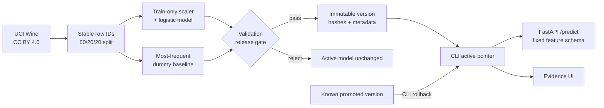

# Model Lifecycle Service

A compact, runnable ML lifecycle for a non-sensitive task: predict one of three wine cultivars from 13 chemical measurements. It trains a real model, compares it with a dummy baseline, freezes train/validation/held-out identities, gates candidates, verifies artifact integrity, supports rollback, serves `/predict`, and exposes evidence in a small UI.

This is portfolio evidence of implementation and verification. It is not a production-performance claim or proof of personal mastery.

## What a user can do

Open <http://127.0.0.1:8115>, adjust a bounded example, and run it through the active model. The page shows the active version, held-out balanced accuracy, dummy baseline, and release-gate outcome. Operational promotion and rollback remain CLI-only.



The scaler and classifier are one scikit-learn `Pipeline`, so preprocessing learns only from the training partition. Candidate choice is fixed (`C=1.0`); this project does no hyperparameter search. The release gate uses only the 20% tuning-validation partition. After candidate configuration and eligibility are fixed, the 20% held-out partition is evaluated once for reporting and cannot alter promotion eligibility.

## Quick start

Requirements: Python 3.12 and [uv](https://docs.astral.sh/uv/). All commands run locally and require no credentials or paid services.

```bash
uv sync --frozen
make test
make train
make demo
```

Then visit <http://127.0.0.1:8115>. `HOST` and `PORT` are explicit deployment controls; defaults are `127.0.0.1:8115`.

```bash
HOST=0.0.0.0 PORT=8115 make demo
curl -s http://127.0.0.1:8115/health
```

Expected health shape:

```json
{"status":"ok","service":"model-lifecycle-service","version":"wine-logreg-v2"}
```

Example prediction:

```bash
curl -s -X POST http://127.0.0.1:8115/predict \
  -H 'content-type: application/json' \
  -d '{"alcohol":13.2,"malic_acid":1.78,"ash":2.14,"alcalinity_of_ash":11.2,"magnesium":100,"total_phenols":2.65,"flavanoids":2.76,"nonflavanoid_phenols":0.26,"proanthocyanins":1.28,"color_intensity":4.38,"hue":1.05,"od280_od315_of_diluted_wines":3.4,"proline":1050}'
```

Missing fields, extra fields, strings masquerading as numbers, non-finite values, and values outside the documented broad physical bounds return 422. The response contains `prediction`, `class_name`, class probabilities, and `model_version`.

## Lifecycle commands

Train creates an immutable candidate directory. Promotion verifies its artifact hash, dataset-manifest hash, serving feature schema, skops type allowlist, and gate result before moving the active pointer.

```bash
uv run modelctl train --version candidate-v1 --registry artifacts/registry
uv run modelctl promote --version candidate-v1 --registry artifacts/registry
uv run modelctl rollback --version candidate-v1 --registry artifacts/registry
```

The gate requires at least `0.10` tuning-validation balanced-accuracy improvement over a most-frequent dummy and `0.60` validation recall for each class. Held-out scores remain informational. A deliberate rejection is reproducible:

```bash
uv run modelctl train --version rejected-dummy --model dummy --registry artifacts/rejection-demo
uv run modelctl promote --version rejected-dummy --registry artifacts/rejection-demo
# exits 2; no active model is changed
```

Rollback accepts only a version recorded as previously promoted. There is no promote, rollback, training, or drift administration endpoint over HTTP.

The drift command is a diagnostic exercise over generated perturbations:

```bash
uv run modelctl drift --simulate --registry artifacts/registry
```

Its output says `SIMULATED_DRIFT_DIAGNOSTIC` and `is_real_monitoring=false`. It is not evidence of real drift detection or monitoring.

## Reproducible checks and evidence

```bash
make setup       # uv sync --frozen
make test        # lint + meaningful unit/integration tests
make benchmark   # train/serve/evaluate/reject/rollback receipt
```

`make benchmark` trains two valid candidates and one dummy candidate in an isolated temporary registry, exercises 200 in-process prediction requests, observes candidate rejection, rolls back to the known first version, and records a clearly simulated drift diagnostic. The receipt captures source revision, dirty-tree state, command, timestamp, machine/Python details, input counts, seed, results, status, and limitations. It is a sequential in-process benchmark, not a network or concurrency capacity claim.

Evidence locations:

- `src/model_lifecycle/bundled_registry/`: read-only-capable deployed demo artifact and metadata
- `evidence/generated/training-receipt.json`: real training/evaluation receipt
- `evidence/generated/benchmark-receipt.json`: serving/lifecycle benchmark receipt
- `evidence/history/`: unchanged pre-correction receipts retained with their original labels and revisions
- `evidence/claims.json`: stable draft claims with implementation and receipt references
- `docs/interview-guide.md`: design explanations, failure demonstrations, and exercises

## Data and licensing

The dataset is UCI **Wine**, 178 rows and 13 numeric chemical measurements, distributed in scikit-learn. UCI publishes it under **CC BY 4.0**, DOI `10.24432/C5PC7J`. See [docs/data-license.md](docs/data-license.md) for attribution, official links, and license boundaries. The repository's original code and fixtures are MIT licensed. No health, credit, identity, customer, employment, or other private data is used.

## Artifact safety and deployment

The project uses `skops`, verifies SHA-256 hashes before loading, rejects unknown serialized types, and checks the exact feature list/count. Promotion binds the approved artifact, metadata, and dataset-manifest digests in the registry; serving and rollback reject later file substitution even if replacement metadata contains internally consistent hashes. This lowers accidental and arbitrary-code loading risk for artifacts created here; it is not a substitute for signatures or a trusted artifact store. Do not load untrusted third-party model or metadata files.

The packaged default registry lives under the Python package and is only read by the ASGI service, which suits stateless read-only deployment. Local training writes to `artifacts/registry` unless another explicit path is supplied. The Docker image copies the bundled registry and runs as one process on port 8115.

The bundled registry retains `wine-logreg-v1` and its original files as historical evidence. The active `wine-logreg-v2` was trained from the corrected validation-gate source revision; only versions with complete saved artifact, metadata, and manifest identities can be loaded or used as rollback targets.

```bash
docker build -t model-lifecycle-service:local .
docker run --rm -p 127.0.0.1:8115:8115 model-lifecycle-service:local
```

The image uses the tracked, hash-verified package artifact and does not train or mutate registry state at startup.

## Honest limits

- UCI Wine is a small, easy, decades-old teaching dataset. Results do not establish business value or production accuracy.
- Lifecycle mutations serialize through a fail-fast exclusive file lock. Registry updates write and fsync a same-directory temporary file, atomically replace the prior file, and fsync the directory where supported. This protects the prior registry if a process dies before replacement; it does not provide distributed coordination or prove physical-power-loss behavior on every filesystem.
- Artifacts have hashes but no signature, remote retention policy, staged rollout, canary, online labels, or automatic rollback.
- The API refreshes and re-verifies the active artifact on every request for clarity, which trades throughput for simple local correctness.
- Drift input is simulated. There is no real feature collection, delayed-label monitor, alert routing, or policy for real user data.
- The benchmark is local and sequential. It does not establish multi-host portability, load capacity, availability, or production latency.
- The service has no authentication because prediction is bounded and read-only; all consequential controls are local CLI operations.

## Repository map

```text
src/model_lifecycle/   dataset, schema, lifecycle, CLI, API, and UI
scripts/benchmark.py   isolated end-to-end benchmark and receipt writer
tests/                 split, serving, failure, integrity, gate, and rollback checks
docs/                  copied contract, license record, and interview guide
evidence/              reproducible receipts and draft claims
```

## Public live demo

[Open Cellar Lab](https://career-model-lifecycle.vercel.app/) to run a bounded prediction through the trained `wine-logreg-v2` model. Health, prediction, validation-partition evidence, missing-input rejection, and non-finite-input rejection were verified from a clean public session. This is a free stateless Vercel Hobby deployment with a ten-second function limit and no external model calls. Training, promotion, rollback and fault controls remain local CLI operations. See `evidence/deployment.json`; the local benchmark is not a cloud latency claim.
